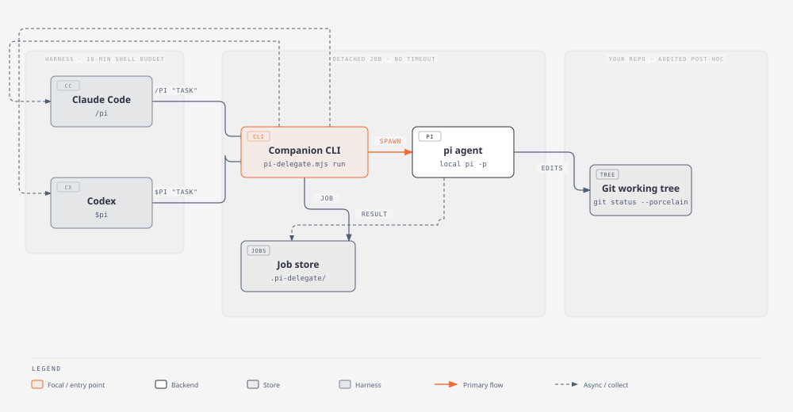

# pi-delegate

Delegate tasks from **Claude Code** and **Codex** to your local **pi** coding agent, as background jobs. One entry point, no personas, no clean-tree precondition.

The companion CLI detaches the pi run from the harness shell, returns a job id, and stores the result; the harness collects it later with `wait <id>`. The working tree is snapshotted before the run and the delta is reported after — audit, not preconditions.



## Why

- **Background jobs, not shell calls.** Harness shell tools have a time budget on the order of ten minutes. `run` starts a detached job — the pi process outlives the shell call — and returns the exact `wait <id>` command to collect it.
- **No clean-tree precondition.** The companion snapshots `git status --porcelain` before the run and reports what changed after. The harness inspects the delta and decides; there is no "commit or stash first" gate.
- **One entry point.** The task text defines the output — implement, research, review, answer — through the same `/pi` (Claude Code) or `$pi` (Codex) call. No personas, no per-task wrappers.
- **The harness stays in control.** `--readonly` restricts pi to read-only tools, `--approve` / `--no-approve` override pi's project trust for the run, and `--timeout` caps each job.

## Install

Prerequisites:

- Node.js — the companion is a single zero-dependency script.
- The local pi agent, installed and configured (its auth and session live under `~/.pi/agent`): [`@earendil-works/pi-coding-agent`](https://www.npmjs.com/package/@earendil-works/pi-coding-agent).

### Claude Code

```bash
claude plugin marketplace add zackzhou-work/pi-delegate
claude plugin install pi@pi-delegate
```

Invoke it in a session as `/pi "task"` (or `$pi "task"`).

### Codex

```bash
codex plugin marketplace add zackzhou-work/pi-delegate
codex plugin add pi@pi-delegate
```

Invoke it in a session as `$pi "task"` (or `/pi "task"`).

### Standalone CLI

The plugin shells are thin; the companion works without either harness:

```bash
git clone https://github.com/zackzhou-work/pi-delegate.git
cd pi-delegate
node companion/pi-delegate.mjs run "task"
```

## Quickstart

```bash
$ node companion/pi-delegate.mjs run --timeout 2m "Reply with exactly one word: pong"
Started background run job.
job id: run-mtgvq0euy (pid 10161)
timeout: 2m
result file (written when the job finishes): .pi-delegate/jobs/run-mtgvq0euy.result.md
Collect: run `wait run-mtgvq0euy --timeout 4m` as a background command (one background wait per job; exit 0 = result printed, 2 = still running — wait again).
Peek: `status run-mtgvq0euy`   Stop: `cancel run-mtgvq0euy`
```

Collect the result — the job id names the pi session, so `continue` can resume it later:

```bash
$ node companion/pi-delegate.mjs wait run-mtgvq0euy --timeout 4m
# Job run-mtgvq0euy (run, done)

pong
[pi-delegate] Working tree unchanged — pi made no file edits.

$ echo $?
0
```

For a foreground run, add `--sync`; the result prints in the same call.

## CLI reference

```text
node companion/pi-delegate.mjs <run|continue|wait|status|result|cancel> [flags] "task"
```

| Subcommand | Purpose |
|---|---|
| `run "task"` | Start a job. Prints the job id and the exact collect command. Default: background. |
| `wait <id> --timeout <n>m` | Block until the job finishes, then print its stored result. |
| `status [id]` | Job table, or one job's JSON plus log tail. |
| `result <id>` | Re-print a finished job's stored output. |
| `cancel <id>` | Stop a running job. The pending `wait` exits 4. |
| `continue "follow-up"` | Resume the most recent job's pi session. Same flags as `run`; execution style follows `run`. |

`run` flags (all optional; `continue` accepts the same set):

| Flag | Effect |
|---|---|
| `--sync` | Foreground: print the result in the same call instead of starting a job. |
| `--prompt-file <path>` / `--stdin` | Long task text without shell quoting. |
| `--approve` / `--no-approve` | Override pi's project trust decision for this run. |
| `--readonly` | pi gets only read/grep/find/ls — for untrusted content. |
| `--model <id>` / `--provider <name>` / `--thinking <level>` | Pass through to pi. |
| `--timeout <dur>` | Job budget (default `10m`). |
| `--no-session` | Run without a persisted pi session. |

### Exit codes

`wait` and `status <id>` branch on the exit code; never parse output to decide whether a job is done.

| Code | Meaning |
|---|---|
| `0` | Done. The result is printed. |
| `2` | Still running. Run the same `wait` again. |
| `3` | The job errored or crashed. |
| `4` | Canceled (`cancel <id>`). |
| `1` | Companion error — the command itself failed. |

### Job lifecycle

```text
run [flags] "task" ──► job id + result file path
                            │
                            ├──► wait <id> ──► 0 · result printed
                            │        │
                            │        └──► 2 · still running — wait again
                            │
                            ├──► status <id> · peek (any time)
                            │
                            └──► cancel <id> ──► 4 · canceled
```

Jobs and results persist under `.pi-delegate/` (git-ignored). The result file path is printed at job start; `result <id>` re-prints it.

### Results and the working-tree report

Every result ends with the tree-audit line: `Working tree unchanged` when pi made no edits, otherwise the delta with rollback commands (`git checkout -- <path>`, or `git checkout .` for everything tracked). Inspect the diff and decide whether to keep the changes before building on them.

Short results are delivered verbatim; long ones as a verdict plus the result-file path.

### Failure protocol

On a companion error (exit `1`) or job error (exit `3`), quote the error verbatim, add one line of diagnosis and a suggested next step, then stop — do not retry with different flags unless the error itself names one.

`continue` failing with `no session file found…` means the previous job never produced a pi session (for example, it failed preflight). Fix the cause and resume with a fresh `run`.

## Safety

- **`--readonly` for untrusted content.** pi gets only read/grep/find/ls; nothing it does can modify the tree or anything outside it.
- **Run unsandboxed.** pi needs `~/.pi/agent` (config, auth, sessions) and network. An error mentioning `EPERM`/`EACCES` on `~/.pi` means the command ran inside a sandbox — rerun with full permissions.
- **Audit, don't precondition.** The tree is snapshotted at start, reported at the end. Rollback is the harness's call, not pi's.
- **Job state stays local.** Everything lives in `.pi-delegate/`. The companion makes no network calls; pi's own model traffic is governed by pi's configuration.

## FAQ

**How is this different from running pi directly?**
`pi -p "task"` runs in the harness shell's budget. pi-delegate detaches the run, stores the result, and gives the harness a collect contract (job id, `wait`, exit codes) that fits its tool model — plus the tree-audit report.

**Does it require a clean git tree?**
No. That is the point: snapshot before, audit after, rollback on request.

**What if pi modifies my files?**
The result reports the delta. Inspect the diff; `git checkout -- <path>` or `git checkout .` restores the tracked tree.

**Which trigger belongs to which harness?**
Both triggers work in both — `/pi` and `$pi` resolve to the same entry point. The skill file (`skills/pi/SKILL.md`) describes the agent-facing contract.

**Can I use it outside Claude Code and Codex?**
Yes. The companion CLI is self-contained; run it from any shell.

**Do the tests pass?**
```bash
node --test "tests/*.test.mjs"
```

## Repository layout

| Path | Purpose |
|---|---|
| `companion/pi-delegate.mjs` | The CLI — single file, zero dependencies |
| `skills/pi/SKILL.md` | The agent-facing contract (triggers, flags, exit codes) |
| `.claude-plugin/` | Claude Code plugin manifest and marketplace |
| `.codex-plugin/` | Codex plugin manifest |
| `templates/prompt.md` | Default prompt template (guardrails) wrapped around each task |
| `tests/` | Node test suite (fake pi binary; no real runs) |
| `assets/pi-delegate.svg` | This README's architecture diagram (source: `assets/pi-delegate.html`) |

## License

[MIT](LICENSE) © 2026 zackzhou